# 1 引言

**动态绑定**是指发送的请求直到运行时才受具体实现的约束。进一步讲，动态绑定允许在运行时彼此替换拥有相同接口的对象，这种可替换性称为**多态**。

可复用的面向对象设计遵循：

1. **针对接口编程，而不是针对实现编程**
2. 优先使用对象组合，而不是类继承。**委托（delegation）**是一种组合方法，举例来说，我们可以在窗口类中保存一个矩形类的实例来代理矩形类的特定操作——一个窗口拥有一个矩形，而不是一个窗口就是一个矩形。

* 设计应支持变化（1.6.7小节中，阐述了一些导致重新设计的一般原因，以及解决这些问题的设计模式，**回过头需要再浏览一遍**）

* 框架与设计模式的区别

# 2 实例研究：设计一个文档编辑器

* 文档结构

  递归组合；为出现在文档结构中的所有对象定义一个抽象类*图元*

* 格式化

  需要考虑到：增加格式化算法不应要求修改已有的图云类，且自由增加图元子类的时候不用考虑格式化算法。

  解决方案：定义一个封装格式化算法对象的类层次结构

  Strategy模式

* 修饰用户界面

  透明围栏（transparent enclosure）(*?*)

  Decorator模式

* 支持对种视感标准

  工厂类和产品类，Abstract Factory模式

* 支持多窗口系统

  对变化的概念（窗口系统实现）进行封装

  Bridge模式，允许分离的类层次一起工作

* 用户操作

  封装一个请求
  
  Command模式
  
* 拼写检查和断字处理

  封装访问和遍历机制，Iterator模式

  给所有分析类型一个相同的接口，Visitor模式

# 3 创建型模式

## Abstract Factory

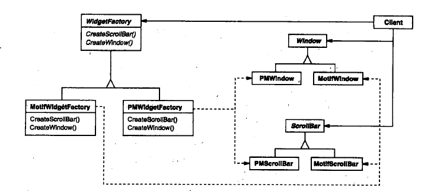

* 一个系统需要由多个产品系列中的一个来配置
* 一个系统要独立于产品的创建、组合和表示
* 强调一系列相关的产品对象的设计以便进行联合使用
* 提供一个产品类库，但只想显示接口而不是实现

## Builder

将一个复杂对象的构建与其表示相分离，使得同样的构建过程可以创建不同的表示。

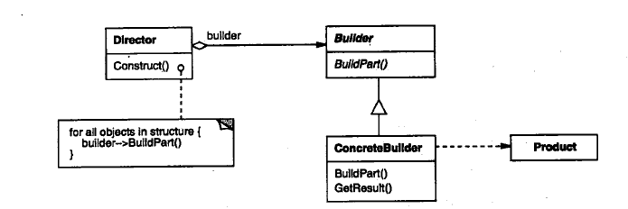

* 创建复杂对象的算法应该独立于该对象的**组成部分**以及**装配方式**
* 当构造过程必须允许被构造的对象有不同的表示时

Builder模式着重于一步步构造复杂对象，而Abstract Factory模式则是立即返回产品

## Factroy Method

定义一个用于创建对象的接口，让子类决定实例化哪个类（使一个类的实例化延迟到其子类）。

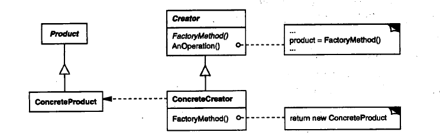

* 当一个类不知道它必须创建的对象的类的时候
* 当一个类希望由它的子类来指定它所创建的对象的时候

和抽象工厂方法的区别：**工厂模式针对的是一个产品等级结构 ，抽象工厂模式针对的是面向多个产品等级结构的。**（ref: https://cloud.tencent.com/developer/article/1523363）

## Prototype

用原型**实例**指定创建对象的种类，并且通过**拷贝**这些原型创建新的对象。

实现：

1. 使用一个原型管理器
2. 实现克隆操作
3. 初始化克隆对象

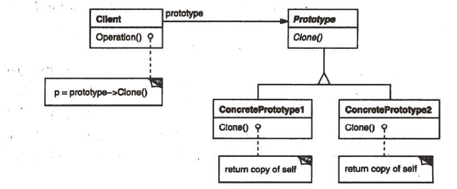

* 当一个系统应该独立于它的产品创建、构成和表示时
* 当要实例化的类是在运行时指定（如动态装载）
* 为了避免创建一个与产品类层次平行的工厂类层次

正如我们在这一章结尾所讨论的那样， Prototype和Abstract Factory模式在某种方面是相互竞争的。但是它们也可以一起使用。Abstract Factory可以存储一个被克隆的原型的集合，并且返回产品对象。

大量使用Composite（4.3）和Decorator（4.4）模式的设计通常也可从Prototype模式处获益。

## Singleton

保证一个类仅有一个实例，并提供一个访问它的全局访问点

1、饿汉模式

```java
public class Singleton {   
    private static Singleton instance = new Singleton();   
    private Singleton(){}    
    public static Singleton newInstance(){        
        return instance;    
    }
}
```

- 从代码中我们看到，类的构造函数定义为private的，保证其他类不能实例化此类，然后提供了一个静态实例并返回给调用者。饿汉模式是最简单的一种实现方式，**饿汉模式在类加载的时候就对实例进行创建，实例在整个程序周期都存在**。
- 它的**好处**是只**在类加载的时候创建一次实例**，不会存在多个线程创建多个实例的情况，**避免了多线程同步的问题**。
- 它的**缺点**也很明显，即使这个单例没有用到也会被创建，而且在类加载之后就被创建，**内存就被浪费**了。
- 这种实现方式**适合**单例**占用内存比较小**，在初始化时就会被用到的情况。但是，如果单例占用的内存比较大，或单例只是在某个特定场景下才会用到，使用饿汉模式就不合适了，这时候就需要用到懒汉模式进行延迟加载。

2、懒汉模式

```java
public class Singleton {    
    private static Singleton instance = null;
    private Singleton(){}    
    public static Singleton newInstance(){        
        if(null == instance){            
            instance = new Singleton();        
        }        
        return instance;  
    }
}
```

- **好处：懒汉模式中单例是在需要的时候才去创建的**，如果单例已经创建，再次调用获取接口将不会重新创建新的对象，而是直接返回之前创建的对象。
- **适用于：**如果某个单例使用的次数少，并且创建单例消耗的资源较多，那么就需要实现单例的按需创建，这个时候使用懒汉模式就是一个不错的选择。
- **缺点：**但是这里的**懒汉模式并没有考虑线程安全问题**，在多个线程可能会并发调用它的`getInstance()`方法，导致创建多个实例，因此**需要加锁解决线程同步问题**，实现如下:

```java
public class Singleton {    
    private static Singleton instance = null;    
    private Singleton(){}   
    public static synchronized Singleton newInstance(){        
        if(null == instance){  
            // Single Checked            
            instance = new Singleton();        
        }        
        return instance;    
    }
}
```

3、双重校验锁【推荐】

> 1. `这个问题在Java面试中经常被问到，但是面试官对回答此问题的满意度仅为50%。`
> 2. `它其实是一个用来创建线程安全的单例的老方法，当单例实例第一次被创建时它试图用单个锁进行性能优化，`
> 3. `但是由于太过于复杂在JDK1.4中它是失败的，我个人也不喜欢它。无论如何，即便你也不喜欢它但是还是要了解一下，因为它经常被问到。`

- 加锁的懒汉模式看起来即解决了线程并发问题，又实现了延迟加载，然而它存在着性能问题，依然不够完美。
- **synchronized修饰的同步方法比一般方法要慢很多，如果多次调用getInstance()**，累积的性能损耗就比较大了。
- 因此就有了双重校验锁，先看下它的实现代码。

```java
public class Singleton {    
    private static Singleton instance = null;    
    private Singleton(){}    
    public static Singleton getInstance() {        
        if (instance == null) {  
            // Single Checked            
            synchronized (Singleton.class) {                
                if (instance == null) { 
                    // Double checked                    
                    instance = new Singleton();               
                }            
            }       
        }        
        return instance;    
    }
}
```

- 可以看到上面在同步代码块外多了一层instance为空的判断。由于单例对象只需要创建一次，如果后面再次调用`getInstance()`只需要直接返回单例对象。
- 因此，大部分情况下，调用`getInstance()`都不会执行到同步代码块，从而提高了程序性能。
- 不过还需要考虑一种情况，假如两个线程A、B，A执行了if (instance == null)语句，它会认为单例对象没有创建，此时线程切到B也执行了同样的语句，B也认为单例对象没有创建，然后两个线程依次执行同步代码块，并分别创建了一个单例对象。为了解决这个问题，还需要在同步代码块中增加if (instance == null)语句，也就是上面看到的代码中的校验2。
- 双检锁隐患：

> 我们看到双重校验锁即实现了延迟加载，又解决了线程并发问题，同时还解决了执行效率问题，是否真的就万无一失了呢？

需要在实例属性前面加上volatile关键字，保证线程可见性，通过设置内存屏障方式禁止指令重排。

```java
private static volatile Singleton sInstance;
```

4、静态内部类【推荐】

- 除了上面的三种方式，还有另外一种实现单例的方式，通过静态内部类来实现。

- 首先看一下它的实现代码：

  ```java
  public class Singleton{    
      private static class SingletonHolder{        
          public static Singleton instance = new Singleton();    
      }    
      private Singleton(){}    
      public static Singleton newInstance(){        
          return SingletonHolder.instance;    
      }
  }
  ```

- 这种方式同样利用了**类加载机制（ 类是由 `JVM`加载，而`JVM`只会加载1遍，保证只有1个单例 ）**来保证只创建一个instance实例。它与饿汉模式一样，也是利用了类加载机制，因此不存在多线程并发的问题。

- 不一样的是，它是在内部类里面去创建对象实例。

- 这样的话，只要应用中不使用内部类，JVM就不会去加载这个单例类，也就不会创建单例对象，从而实现懒汉式的延迟加载。也就是说这种方式**可以同时保证延迟加载和线程安全**。

5、枚举

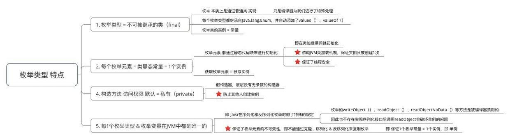

```java
class Resource{}
public enum SomeThing {    
    INSTANCE;    
    private Resource instance;    
    private SomeThing() {        
        instance = new Resource();    
    }   
    public Resource getInstance(){        
        return instance;    
    }
}
```

- 上面的类Resource是我们要应用单例模式的资源，具体可以表现为网络连接，数据库连接，线程池等等。 
- 获取资源的方式很简单，只要 **SomeThing.INSTANCE.getInstance()** 即可获得所要实例。
- **下面我们来看看单例是如何被保证的：**
  - 首先，在枚举中我们**明确了构造方法限制为私有**，在我们访问枚举实例时会执行构造方法。
  - 同时每个***枚举实例都是static final类型的***，也就表明只能被实例化一次。在调用构造方法时，我们的单例被实例化。 
  - 也就是说，因为`enum`中的实例被保证只会被实例化一次，所以我们的INSTANCE也被保证实例化一次。 

# 4 结构型模式

## Adapter

将一个类的接口转换成客户希望的另一个接口。使得原本由于接口不兼容而不能一起工作的那些类可以一起工作。

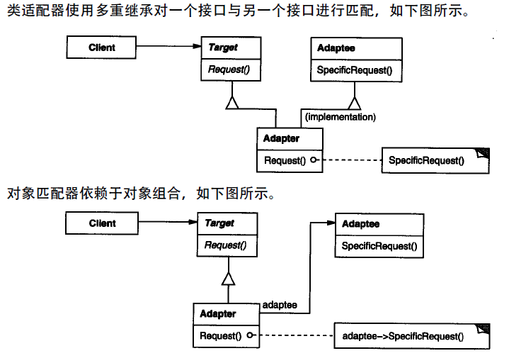

* 你想使用一个已经存在的类，而它的接口不符合你的需求。
* 你想创建一个可以复用的类，该类可以与其他不相关的类或不可预见的类（即那些接口可能不兼容的类）协同工作。
* （仅适用于对象Adapter）你想使用一些已经存在的子类，但是不可能对每一个都进行子类化以匹配它们的接口。对象适配器可以适配它的父类接口。

Adapter模式是改变已有对象的**接口**， Bridge模式结构与对象适配器相似，但目的是将接口部分与实现部分分离

## Bridge

将抽象部分与其实现部分分离，使它们可以独立变化

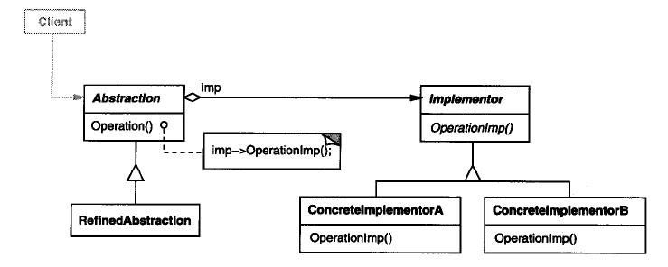

Abstract Factory(3.1) 模式可以用来创建和配置一个特定的Bridge模式。

Adapter(4.1) 模式用来帮助无关的类协同工作，它通常在系统设计完成后才会被使用。然而，Bridge模式则是在系统开始时就被使用，它使得抽象接口和实现部分可以独立进行改变。

## Composite

将对象组合成树形结构以表示“部分-整体”的层次结构，使得用户对单个对象和组合对象的使用具有一致性

*Composite模式的关键在于一个抽象类，既可以代表图元，又可以代表图元的容器*

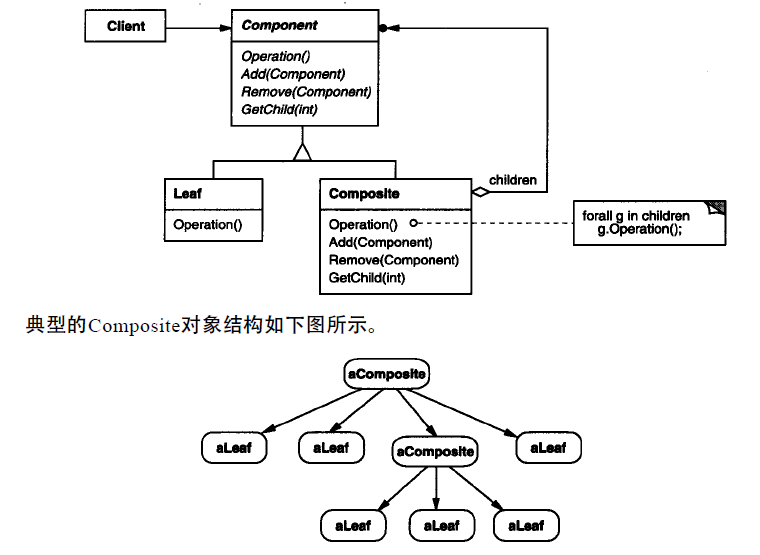

实现：

* 显式的父部件引用
* 共享组件
* 最大化Composite接口
* 声明管理子部件的操作

## Decorator

动态、透明地给单个对象添加一些额外的职责；就增加功能来说，Decorator模式相比生成子类更加灵活。

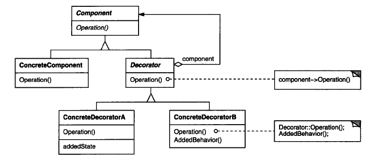

实现：

* **接口的一致性** 装饰对象的结构必须与它所装饰的Component的接口是一致的
* **保持Component类的简单性** 为保证接口一致性，组件和装饰必须有一个Component父类，这个类应集中定义接口而不是存储数据。

Decorator是改变对象外壳的一个很好方式，而Strategy模式是改变对象内核的方式

## Facade（外观）

为子系统中的一组接口提供一个一致的界面，Facade模式定义了一个高层接口，这个接口使得子系统更加容易使用。

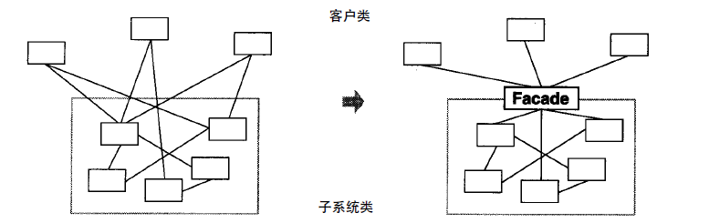

通常来讲，仅需要一个Facade对象，因此Facade对象常常属于Singleton模式。

## Flyweight（享元）

运用共享技术有效地支持大量细粒度的对象，对那些通常由于数量太大而难以用对象来表示的概念或者实体进行建模。

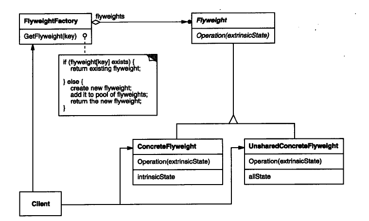

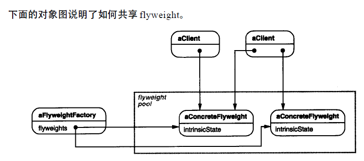

Flyweight模式通常和Composite(4.3)模式结合起来，用共享叶结点的有向无环图实现一个逻辑上的层次结构。

通常，最好用Flyweight实现State(5.8)和Strategy(5.9)对象。

## Proxy

为其他对象提供一种代理以控制对这个对象的访问，确保只有在确实需要这个对象时才对它进行创建和初始化。

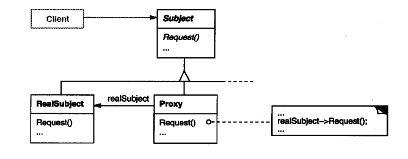

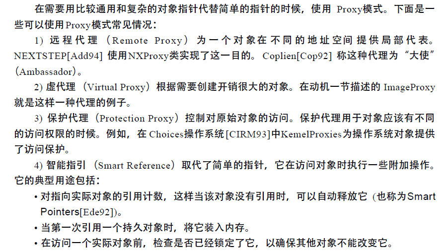

# 5 行为型模式

类行为型模式使用继承机制在类间分派行为；对象型行为模式使用对象组合而不是继承。

## Chain of Responsibility

对象行为模式

使多个对象都有机会处理请求，从而避免请求的发送者和接收者之间的耦合关系。将这些对象连成一条链，并沿着这条链传递该请求，直到有一个对象处理它为止。

沿链转发请求，并保证接收者为隐式的，每个在链上的对象都有一致的处理请求和访问链上后继者的接口。

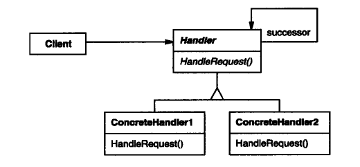

常与Composite一起使用，这种情况下，一个构件的父构件可作为它的后继。

## Command（?）

类行为模式

将一个请求封装成一个对象，从而使你可用不同的请求对客户进行参数化，对请求排队或记录请求日志。

Command模式是回调机制的一个面向对象的替代品。

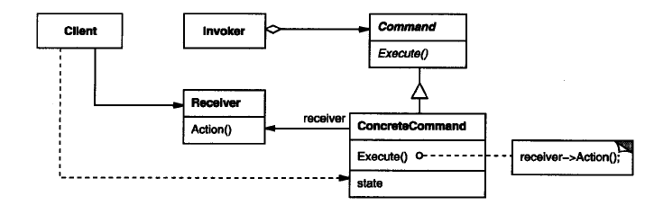

## Interpreter

类行为型模式

给定一个语言，定义它的文法的一种表示，并定义一个解释器，这个解释器使用该表示来解释语言中的句子。

> This pattern is used in SQL parsing, symbol processing engine etc.

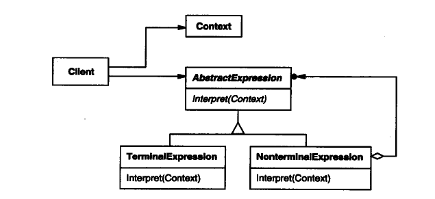

## Iterator

对象行为模式

提供一种方法顺序访问一个聚合对象中的各个元素，而又不需要暴露该对象的内部表示。

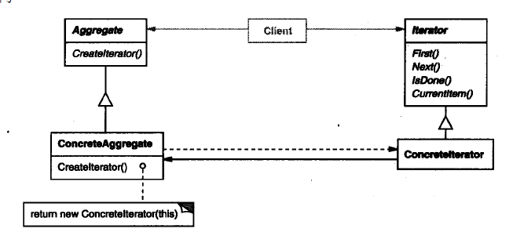

效果：

* 支持以不同的方式遍历一个聚合
* 简化了聚合的接口
* 在同一个聚合上可以有多个遍历

内部迭代器与外部迭代器

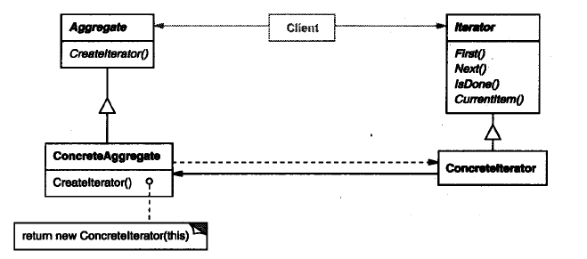

## Mediator

对象行为型模式

用一个中介对象来封装一系列的对象交互。中介者使各对象不需要显示地相互引用，从而使其耦合松散，而且可以独立地改变它们之间的交互。

动机：虽然将一个系统分隔成许多对象通常可以增强可复用性，但是对象间相互连接的激增会降低其可复用性。

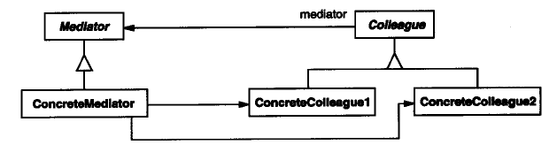

缺点：在**具体中介者类中包含了大量同事之间的交互细节**，可能会导致具体中介者类非常复杂，使得系统难以维护。（也就是把具体同事类之间的交互复杂性集中到了中介者类中，结果中介者成了最复杂的类）

## Memento

对象行为型模式

不破坏封装性的前提下，捕获了一个对象的内部状态，并在该对象之外保存这个状态，之后可以将该对象恢复到原先保存的状态。

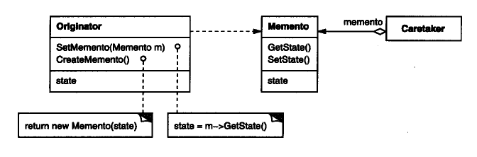

备忘录实际上有两个接口，管理者（Caretaker）只能看到备忘录的窄接口—它只能将备忘录传递给其他对象。相反, 原发器能够看到一个宽接口, 允许它访问返回到先前状态所需的所有数据。理想的情况是只允许生成本备忘录的那个原发器访问本备忘录的内部状态。

## Observer

对象行为型模式

定义对象间的一种一对多的依赖关系，当一个对象的状态发生改变时，所有依赖于它的对象都得到通知并被自动更新。

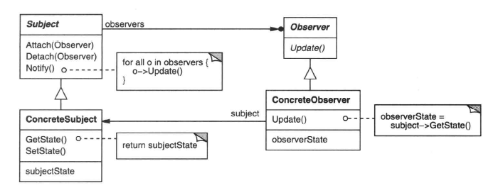

实例：ClockTimer是一个用于存储和维护一天时间的具体目标。它每秒钟通知一次它的观察者。

一个目标所知道的仅仅是它有一系列观察者，每个都具有符合抽象的Observer类的简单接口。

## State

对象行为型模式

允许一个对象在其内部状态改变时改变它的行为。

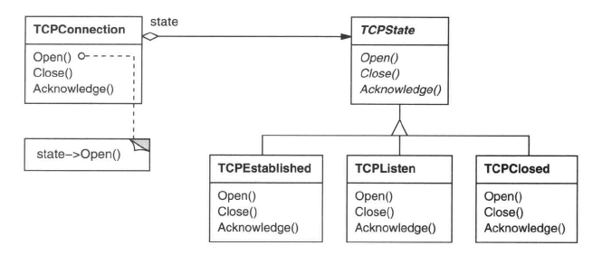

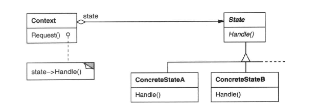

* 将与特定状态相关的行为局部化（放入一个对象当中），并且将不同状态的行为分割开，因此通过定义新的子类可以很容易增加新的状态
* 状态转换显式化
* State对象可被共享

状态对象通常是Singleton

## Strategy

对象行为型模式

定义一系列算法，将它们分别封装，并且使它们可相互替换。本模式使得算法可独立于它的客户而变化。

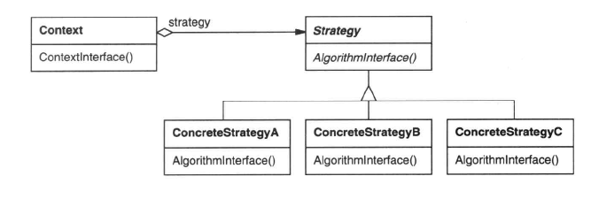

## Template Method

类行为型模式

定义一个操作中的算法的骨架，将一些步骤延迟到子类中。Template Method使得子类可以不改变一个算法的结构即可重定义该算法的某些特定步骤。

通过使用抽象操作定义一个算法中的一些步骤，模板方法确定了它们的先后顺序。

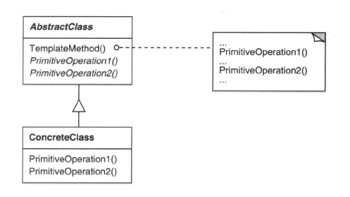

Factory Method模式常被模板方法调用。
模板方法使用继承来改变算法的一部分。Strategy使用委托来改变整个算
法。

## Visitor

对象行为型模式

表示一个作用于某对象结构中的各元素的操作。它使你可以在不改变各元素的类的前提下定义作用于这些元素的新操作。

对于Visitor模式，必须定义两个类层次：一个对应于接受操作的元素，一个对应于定义对元素的操作的访问者（Visitor）

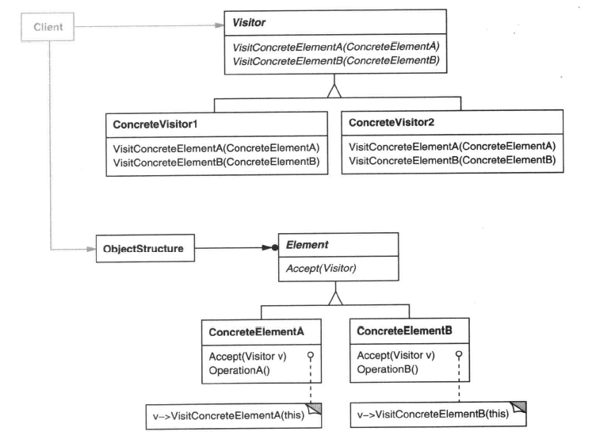

实现：

* 单分派（Single-Dispatch）语言中，执行的操作取决于该请求的名字和接受者的类型
* 双分派语言中，执行的操作取决于请求的种类和两个接收者的类型